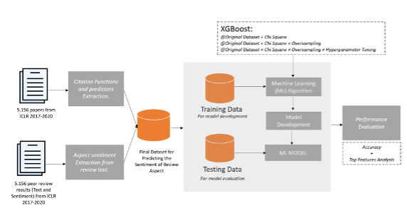

# Paper
***"Predicting the Sentiment of Review Aspects in the Peer Review Text using Machine Learning"*** <br>
You can access via this link down below:<br>

[Paper](#)


This repo contains code and implementation of classification on International Conference on Learning Representations (ICLR) 2017-2020 paper dataset.

## Abstract
<p align="justify"> This paper develops a Machine Learning (ML) model to classify the sentiment of review aspects in the peer review text. Reviewers use review aspect as paper quality indicators such as motivation, originality, clarity, soundness, substance, replicability, meaningful comparison, and summary during the review process. The proposed model addresses the critique of existing peer review process, including a high volume of submitted papers, limited reviewers, and reviewer bias. This paper uses citation functions, representing the reason why author of scientific papers cites previous works, as the main predictor. Specifically, the predictor comprises citing sentence features created based on labeling scheme of citation functions, regular sentence features created by applying the label of citation functions to non-citation text, and reference-based features obtained by identifying the source of citation. This paper utilizes the International Conference on Learning Representations (ICLR) 2017-2020 paper dataset, which includes sentiment values (positive or negative) for all review aspects. Our experiment on combining XGBoost, oversampling, and hyper-parameter optimization revelaed that not all review aspects can be effectively estimated by the ML model. The highest results were achieved when predicting Replicability sentiment with 97.74% accuracy. It also demonstrated accuracies of 93.93% for Meaningful Comparison and 94.03% for Motivation. However, the model exhibited lower effectiveness on Originality and Substance (85.21% and 79.94%) and performed less effectively on Clarity and Soundness with accuracies of 61.22% and 61.11%, respectively. Additionally, while the regular sentence is the top predictor only for Replicability, the combination predictor is most effective in achieving the best results for Meaningful Comparison, Motivation, and Substance.</p>

## Dataset
<p align="justiify">This paper uses dataset for both papers and its review results from ICLR 2017-2020 containing 5,156 papers (Yuan et al., 2022) as shown in Table I. While the final decision of paper acceptance is already available in the dataset and is determined by the ICLR’s editor, the paper quality (good/poor) is adopted from the research conducted in our previous research (Basuki & Tsuchiya, 2022b).</p>

**TABLE II.** DISTRIBUTION OF ICLR PAPERS USED IN THE PREDICTION SYSTEM

<p align="center"></p>

| Year | Accepted Papers | Rejected Papers | Total Papers | Good Papers | Poor Papers | Total Papers |
|---|---|---|---|---|---|---|
| 2017 | 198 | 502 | 686 | 416 | 71 | 487 |
| 2018 | 289 | 1048 | 1337 | 769 | 138 | 907 |
| 2019 | 336 | 1526 | 1862 | 1275 | 275 | 1550 |
| 2020 | 571 | 1722 | 2293 | 1115 | 1097 | 2212 |
| **Total** | **1404** | **4798** | **6208** | **3575** | **1581** | **5156** |

## Experiment Scenario
<p align="center">
    
</p>
<p align="justify">The prediction system is seen as classification problem with two target sentiment classes, i.e., positive and negative. Since this paper uses four predictors, the experiments are performed based on four scenarios. Each of the scenario involves three prediction settings, i.e., original dataset with feature selection, balanced dataset with feature selection, and balanced dataset with feature selection and hyper-parameter optimization. This paper uses Chi-Square for feature selection and random over sampling for data balancing. Since the format of generated features are tabular, the XGBoost is the most appropriate option for classification algorithm due to the superior performances in many experiments. Notably, all scenarios will be applied to all review aspects and the classification performance of each paper is measured using accuracy and the number of features for obtaining the best results.</p>

## Paper & Citation


```bibtex
@misc{..,
  doi = {...},
  url = {...},
  author = {Basuki, Sari, Tsuchiya and Indrabayu},
  keywords = {Review-Aspect, ICLR, Classification, and XGBoost},
  title = {Predicting the Sentiment of Review Aspects in the Peer Review Text using Machine Learning},
  publisher = {Kinetik},
  year = {2024},
  copyright = {Creative Commons Attribution 4.0 International}
}
```